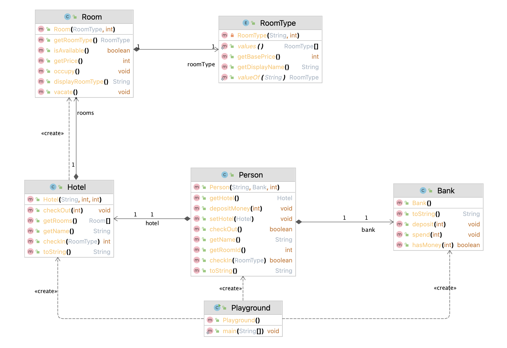

# 🏨 The Java Hotel Management System

This project involves creating a hotel management system in Java, simulating the process of checking in and out of a hotel, provided certain requirements are met. The project helps in improving your understanding of Java syntax and object-oriented programming (OOP) concepts.

## Goal

Upgrade and improve your understanding of Java syntax through practice. Apply and understand object-oriented programming concepts in Java by creating and implementing methods and manipulating objects to simulate a hotel management system.

## Skills

- Create classes and define methods with Java.
- Learn how to use getters and setters to access and modify object properties.
- Practice using composition and delegation to create a hotel simulation system.
- Use constructors to initialize objects with default and custom values.
- Declare methods and use return values to perform specific tasks in your program.
- Utilize loops to iterate over arrays and manipulate array elements.
- Work with primitive and reference Java types and understand the differences between them.
- Understand how to use enums.

## Instructions

The task is to create a hotel management system with Java. The system should allow one or more people to check in and out of a hotel. Below is a general outline of the requirements:

- A hotel can have rooms of type Single, Double, or Suite, all with different prices.
- A hotel has many rooms available, and these rooms can eventually be occupied.
- A hotel should be able to occupy or vacate its rooms.
- A person can only check in to a hotel they’re not already staying at.
- A person can only check in to a hotel that isn’t fully booked.
- A person can only check out of a hotel that they’re staying at.
- A person must have a way to identify themselves at this hotel (e.g., a hotel key or room number).
- A person shouldn’t be able to check out of another person’s room accidentally.
- A person must have a bank where they can keep track of their money to pay for the hotel. Financial activity should be handled by the bank, not the person directly.
- A person must have sufficient funds in the bank to pay for their stay.
- When checking in, a person must state whether they want a Single, Double, or Suite.

## UML Diagram

The UML diagram below provides a structural overview of the classes involved:



## Requirements

- Java Development Kit (JDK) 17 or above.
- A Java IDE like IntelliJ IDEA, or any other of your choice.

## Installation

Clone the repository and navigate to the folder.

```bash
git clone <repository-url>
cd <repository-folder>
```

## Usage

To run the Java implementation of the hotel management system:

1. Compile the Java files:

```bash
javac *.java
```

2. Run the main class:

```bash
java Playground
```

## Contributing

Pull requests are welcome. For major changes, please open an issue first to discuss what you would like to change.

Please make sure to update tests as appropriate.
